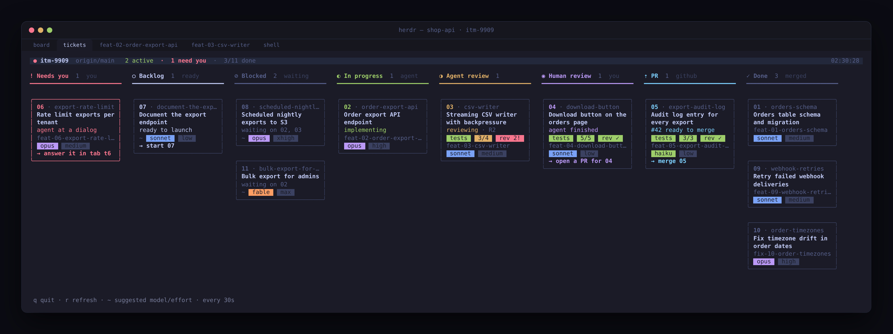

# 0005 — `.scratch` is the only board home; retro closes a board; `/small-ticket` writes documents

- **Status:** Accepted
- **Date:** 2026-10-08
- **Deciders:** Daniel Ulisses
- **Builds on:** [0004](0004-haiku-board-session.md)

## 1. Boards live only under `.scratch/`

Boards could live in two homes: files under `.scratch/<board>/`, or GitHub issues under a
`ticket:<board>` label. In practice the developer uses `.scratch/`, and the GitHub home was a
second parser, run-state written as issue comments, labels, native dependencies, and every board
script in two branches. It is gone:

- `/ticket` always writes `.scratch/<board>/issues/<NN>-<slug>.md`, whatever tracker the repo has.
- `board-lib.sh` resolves a Jira id, a slug or a path to one folder and parses only files;
  `tk.sh`, `pr-open.sh` and `merge-conflict.sh` lost their GitHub-board branches.
- **PRs live on the repo's forge** — GitHub or Azure DevOps (§7). That is about where the code
  goes, not where the board is.
- **A repo with no remote is supported.** The board scripts take the local base as the merge
  target, skip the fetch and the PR leg, and the PR verbs say to merge locally instead.

## 2. Retro closes a board, before the sweep

0004 added `ticket-memory-curator`, which turned the tickets' `## Remember` sections into a
project-memory diff. That is one slice of what mattpocock's `retro` skill (v1.3+) does: it reads a
session's own logs and proposes improvements to the agent's environment — navigation hints,
automated checks, coding standards, steering files, tool economy, no-op instructions, information
access. The curator is replaced by **`ticket-retro`** (Sonnet @ medium), which does both:

- `tk.sh retro <board>` gathers its input deterministically: each ticket's saved report, the Claude
  Code transcripts its worktree left (found under every config root by the worktree's encoded path,
  since an `--account` ticket logs under its own), and a cheap extract of each — how often each tool
  ran, and the most frequent tool errors. A ticket transcript can be megabytes; the agent starts from
  the extract and `grep`s for evidence rather than reading one whole.
- The agent Reads `retro` and `writing-for-agents` from the installed skills (the board session runs
  with skills disabled; `retro` is user-invoked anyway) and returns a project-memory diff first, then
  environment changes by severity. It writes nothing.
- It runs **before `/sweep-tickets`**, as the board's last step: the board prompt offers it when every
  ticket is resolved and only then points at the sweep.

## 3. `/small-ticket` writes documents: `--doc`, and repos with no remote

Presales work is mostly scoping a deliverable and writing it into a repo of documents — often with
no remote — whose output is a Markdown file or a PDF. Two things stopped `/small-ticket` doing that:

- **The launcher required a remote** and pulled before branching. Now, with no `TICKET_REMOTE`
  remote, it logs it, skips the pull and branches from the local base as it stands; the summary's
  `BRANCH=` line says `local, no remote`. `/sweep-tickets` already fell back to the local base, and
  the board scripts do too (section 1).
- **The brief and the reviewer assumed code** — seams, a test suite, a security/IaC checklist. A
  `--doc` launch (only `/small-ticket` has one; the wrapper sets `DOC_TEMPLATE`) renders
  `templates/doc-prompt.md` instead, and swaps `ticket-reviewer` for **`ticket-doc-reviewer`**
  (Opus @ medium, `TICKET_DOC_REVIEW_*`). The orchestrator gathers sources with scouts and
  researchers, scopes the document with the developer — `mattpocock-skills:grilling` where the
  scope is open, since a presales document commits someone to something — and presents the
  **outline as the plan**: audience, sections, in/out of scope and assumptions, the estimate
  method, sources, output and render command, acceptance criteria. `ticket-implementer` drafts it
  with every claim traced to a source and every assumption marked; `ticket-doc-reviewer` reviews
  commitments, accuracy, numbers, coverage, clarity and house style; a tester renders it (the
  repo's command, or `pandoc`/`typst`) while criteria checkers check the outline's criteria. The
  hand-off leads with the open assumptions to confirm with the client. Nothing is sent anywhere.

The summary's new `KIND=` line says which brief launched. `/small-ticket` decides between code and
document from the ticket's deliverable and says so in one line; it asks only when it can't tell.

## 4. Untested changes get a harder review and an expected plan

Some repos have nothing that can run a change before it reaches a real environment — Terragrunt
and Terraform stacks, Helm charts, pipelines. There the code review is the last check, and `opus @
medium` is the wrong depth for it.

- **The effort rises automatically.** A ticket whose `**Seams under test:**` line says `None` — the
  line `/ticket` already writes for exactly this case — launches its reviewer at
  `TICKET_REVIEW_EFFORT_UNTESTED` (`high`), through the same `--agents` definition. `/small-ticket`
  passes `--review-effort` when the repo has no suite or the change only runs live; the flag beats
  both. The summary's `REVIEWER=` line names the level and why.
- **The reviewer traces instead of skims.** `ticket-reviewer` gained a *When nothing runs the change*
  checklist: every input to its use, resource addresses (rename / `for_each` key / module version →
  replace unless `moved`), force-new attributes, blast radius through shared modules and
  `dependency` blocks, backend and state keys, what runs at plan time, and what the offline checks
  (`hclfmt`, `validate`, `tflint`) don't prove.
- **It ends with an Expected plan** — per stack, the addresses to add, change, replace and destroy,
  "nothing to destroy" said out loud — which the coordinator puts in the hand-off. The developer
  runs the live plan and compares: anything outside the expectation is the finding no test could
  have caught.

Agents still never run a plan or anything else against a real environment; the plan is the
developer's.

## 5. `ticket-reviewer` runs mattpocock's code review

0002 took `mattpocock-skills:code-review` out of the `/ticket` coordinator, so it wouldn't run in the
coordinator's low-effort context, and split its axes across `ticket-reviewer` and the criteria
checkers — losing Matt's smell baseline and the skill's own process. It's back, in the reviewer:

- `ticket-reviewer` gained the `Skill` tool and calls `mattpocock-skills:code-review` first, with the
  overrides the old brief used: fixed point = the base commit, diffed against the working tree;
  spec = the ticket or approved plan; standards = the repo's documents plus the smell baseline.
- **It runs both axes itself, not in the skill's sub-agents.** A sub-agent's effort comes from its
  definition or the session, and the ticket session's is the coordinator's `low`; the reviewer's
  own `medium` — `high` when untested — is the effort the review is meant to get.
- Its own checklist (correctness, security, infra, the untested checklist and Expected plan) follows,
  and the findings come back as one deduplicated list, each tagged with its axis.
- Ticket sessions keep skills enabled; only the board session disables them, and the reviewer never
  runs there. Where the skill is missing, the reviewer says so and uses its own list.

## 6. A status board in a Herdr tab

`tk.sh view <board> [--watch <secs>]` renders the board for the developer, grouped by where each
ticket actually is: **needs you** (agent at a dialog, no live agent, landing unknown), **PR** (open,
with checks running / failed, conflict, changes requested, awaiting review or ready to merge),
**human review** (agent finished), **agent review** (verifying, reviewing, fixing, reporting),
**in progress** (recon, implementing), **backlog** (ready to launch), **blocked** (waiting on named
tickets) and **done**. It's a script reading the same board, Herdr state, git and `gh` the digest
reads — no model, so it costs nothing to leave open — and `board.sh` opens it, refreshing every 30s
(`TICKET_BOARD_VIEW`), **in a `tickets` tab of its own** — the full width fits the most columns.
`TICKET_BOARD_VIEW_PLACEMENT=right` or `=down` splits the board session's pane instead (`herdr pane
split --current --direction …`, the calling pane from `HERDR_PANE_ID`, the new one read from
`.result.pane.pane_id`, then `herdr pane run`); Herdr splits only right or down, so a split always
sits beside or below the session. A refused split falls back to the tab; where Herdr won't do either, it
prints the command. The view fits its pane: below 90 columns each note moves to its own line.

Herdr shows an agent as `working` whether it's implementing or reviewing, so `/ticket`'s coordinator
now writes its phase — one word — to `~/.local/state/ticket-skill/<repo>/phase/<branch>` at each
phase of its brief (`{{PHASE_FILE}}`); that, with its report file, is all it writes outside the
worktree.

The view is drawn as a **Trello-style board** (`scripts/board-view.jq`): a column per status — NEEDS
YOU first, then backlog → blocked → in progress → agent review → human review → PR → done — and a
bordered card per ticket carrying its number and title, where it stands, and **what implements it**:
the run's model · effort once launched, or `~` and the ticket's suggestion (else the launcher's
default) before. Empty columns are left out; columns that don't fit side by side wrap into further
rows, so the half-width pane beside the board session still reads. DONE shows three cards and a count.

The layout borrows from **herdr-board**'s TUI — and only its layout; its engine (cards as agent runs,
columns as prompts, a SQLite store) was looked at and passed over, for the reasons 0001 passed over
herdr-projects. Two of its ideas came across: a **check-chip row** — the coordinator now writes a
second line to its phase file (`tests=pass criteria=3/4 review=2-blocking`) and the round on the
first (`reviewing r2`), shown as `reviewing · R2` and `[tests] [3/4] [rev 2!]`, green / yellow / red —
and an **action hint** on cards waiting on the developer, phrased as what to type into the board
session (`→ open a PR for 04`, `→ merge 05`, `→ start 07`, `→ answer its dialog`). The header gains a
live dot (red when anything needs the developer) and the active and needs-you counts.

It runs as a proper full-screen TUI: the alternate screen (the scrollback comes back on exit), no
cursor, redrawn in place rather than cleared (no flicker), `q` to quit, `r` to refresh now, and an
immediate redraw on resize. Colour is by role, so a theme is a palette — Tokyo Night by default,
Catppuccin, Gruvbox or Nord (`TICKET_VIEW_THEME`) — in 24-bit colour where the terminal sets
`COLORTERM=truecolor`, mapped onto the 16 ANSI colours otherwise, and none under `NO_COLOR`. A filled
header bar carries the status dot, the board, the base and the active / needs-you / done counts; each
column has an icon; chips are dark text on the role's colour.

## 7. PRs on GitHub or Azure DevOps

The board's PR leg — the merge gates, `merge`, the landing check, the status board's PR column and
`pr-open.sh` — called `gh` directly, so a repo on Azure DevOps had boards that could launch and
review but never open, gate or merge a PR. They now go through a small **forge layer** in
`board-lib.sh`:

- **Detection.** `board_init` reads the remote's URL: `dev.azure.com`, `*.visualstudio.com` or their
  SSH hosts mean Azure DevOps, anything else GitHub; no remote, no forge. `TICKET_FORGE=github|azure`
  overrides it. For Azure the organization, project and repository are parsed from the URL and passed
  to every `az` call, so a remote not named `origin` works and nothing depends on `az devops configure`.
- **One PR shape.** Each forge's PR is normalized to `{number, url, isDraft, base, mergeable, review,
  checks:[{n, s: ok|pending|bad}]}`, and every caller reads only that. Azure's mapping: `mergeStatus`
  `succeeded`/`conflicts` → mergeable/conflicting; reviewer votes and reviewer policies → review (any
  `-5`/`-10` vote is changes requested; an unmet reviewer policy or a required reviewer without an
  approving vote is review required); every other **blocking, enabled** policy — build validation,
  status checks, comment resolution, linked work items — is a check (`approved`/`notApplicable` ok,
  `running`/`queued` pending, anything else failed). The five gates and their exit codes are unchanged.
- **Merge.** GitHub keeps the repo's default method. Azure completes the PR with
  `TICKET_AZURE_MERGE` (`squash`, the default, or `merge`), never bypassing policy and never deleting
  the source branch — the same two nevers as `--admin` and `--delete-branch` on GitHub. Azure merges
  asynchronously, so `merge` waits a few seconds for `completed` and otherwise reports the PR still
  active rather than claiming it merged.
- **Opening.** `pr-open.sh` commits and pushes exactly as before and opens the PR with
  `az repos pr create` on Azure. Azure caps a description at 4000 characters: `check` prints
  `FORGE Azure DevOps` so `ticket-pr-creator` keeps the body under it, and a longer one is cut with a
  note rather than refused.
- **Requirements.** GitHub: `gh`, logged in. Azure: `az` with the `azure-devops` extension, logged in
  (`az devops login`, or `AZURE_DEVOPS_EXT_PAT`); the PR verbs say exactly that when it's missing,
  while the landing check and the status board simply skip the forge.

The Azure field names (`mergeStatus`, `reviewers[].vote`, policy evaluations'
`configuration.type.displayName` and `status`) follow the Azure DevOps REST API that `az repos pr`
returns; the scripts were exercised against stubs, so the first real Azure board is the check that
they match.

### 7a. "Has it landed" without the forge

Azure DevOps and GitHub both default to squash merges, which ancestry never sees, so a PR merged in
the web UI was found only by asking the forge — and an `az` or `gh` that wasn't logged in failed
silently, leaving the ticket in progress. `landed()` now checks, for the local branch **and** its
remote-tracking copy (fetched each digest, so a fix pushed to the PR from elsewhere counts):
ancestry; then whether some commit on the base already contains every change the branch made — each
candidate commit touching the branch's files is checked itself, so a base that edited those files
again since still matches (`merge-tree --write-tree` on git 2.38+, a file comparison before). The
forge is the last resort, for a branch whose content changed after its last fetch and was deleted on
merge; when it can't be asked, the digest prints one `WARN` with the forge's own error. Resolving a
squash records the squash commit. `tk.sh why <board> <NN>` (`tkw`) prints every step.

## 8. A ticket lives on the board of the repo it changes

A ticket's worktree, branch and PR are made in the repo its board is in. A ticket planned in one
repo for code in another was launched in the wrong place: its agent worked outside its own branch,
the PR was opened in the other repo, and the board could never see it land — it had to be forced
resolved. So:

- `/ticket` gives every ticket a `**Repo:** <name> — <path>` line, splits a slice touching two repos
  into one ticket per repo, and writes each ticket to **that repo's** `.scratch/<board>/` — one board
  per repo under the same name, numbered as one sequence, with a `.scratch/<board>/repos` file
  (`<name> <path>` per line) in each. Phase 3 prints one board command per repo.
- A blocker on another repo's board is written `<repo>:<NN>`. `load_board` reads its status from that
  repo's board of the same name (the `repos` path, else a sibling directory) and holds the ticket
  until it is resolved there; one it can't find counts as open, with a `WARN`.
- `tk.sh launch` and `pr-open.sh` refuse a ticket whose `**Repo:**` isn't the board's own repo, the
  digest warns about it and keeps it off the frontier, and the status board shows it under NEEDS YOU
  ("belongs on api's board"). A ticket without a `**Repo:**` line is taken as this repo's, as before.
- `/small-ticket` runs its launcher from the root of the repo the ticket changes.

### 7b. No prompts, no waiting per ticket

An agent runs the forge and push calls with no terminal, so anything that asks — Git Credential
Manager's browser sign-in (which ignores `GIT_TERMINAL_PROMPT=0`), an ssh passphrase, `az` offering
to install an extension — hung the PR creator with nothing on screen. Every network call now runs
non-interactive (`GCM_INTERACTIVE=never`, ssh `BatchMode`, no askpass, `az` dynamic install off,
stdin closed) under `TICKET_NET_TIMEOUT` (90 s); a timeout names the likely sign-in, and `pr-open.sh`
prints `STEP` lines and says how to retry (`open` with an empty paths file — the commit stands).

The digest, which starts every board turn, also asked per ticket: a fetch of each ticket branch and an
`az` lookup each — seconds apiece on Azure, minutes on a busy board before the board got to the
request. It now makes one `ls-remote` and one fetch for the whole board, and one listing of merged
PRs (the status board: one of open PRs too) answers every ticket; a digest over 15 s prints a `WARN`
saying where the time went.

## 9. The Cursor CLI writes PRs; nothing carries attribution

Opening a PR is writing a commit message and a PR body — no design judgement — yet it ran on a Claude
subagent (Sonnet) billed to the subscription the tickets need. It now runs on the **Cursor CLI**:
`tk.sh pr <board> <NN>` (the board's "open a PR for NN") runs `pr-cursor.sh`, which takes
`pr-open.sh check`'s refusals first, then sends `cursor-agent -p` one prompt — the check output, recent
commit subjects, the ticket, its report, the PR template, the `pr` skill (Cursor's own install, else the
mattpocock one) and the capped diff — and asks for one JSON object: title, commit message, body, paths,
left-out paths. Cursor runs no command and writes no file; its answer goes to `pr-open.sh open`, so the
commit is still exactly the named paths, on the ticket's branch, without force. The board session runs
a script rather than dispatching an agent. `TICKET_PR_RUNNER=claude` keeps `ticket-pr-creator` (`tk.sh pr`
exits 5 and the board dispatches it). Cursor needs `cursor-agent login` or `CURSOR_API_KEY`;
`TICKET_PR_CURSOR_MODEL` picks its model.

No commit message or PR body the workflow makes carries tool attribution — no `Co-authored-by`
trailer, no "Generated with" line, no session link. `pr-open.sh` strips them from whatever it is given,
Cursor's answer or the Claude agent's, so no agent's habit can slip one through; the merger's commit
uses git's own merge message.

`tk.sh merge` merges the **PR on the forge** — what the merge button does — never a local merge; the
local base is untouched until the developer pulls. In a repo with no remote it refuses: the developer
merges the branch locally and the next digest resolves it. The merger's conflict resolution merges the
base *into the ticket's branch* and pushes that branch; the PR is still merged by `tk.sh merge`.

